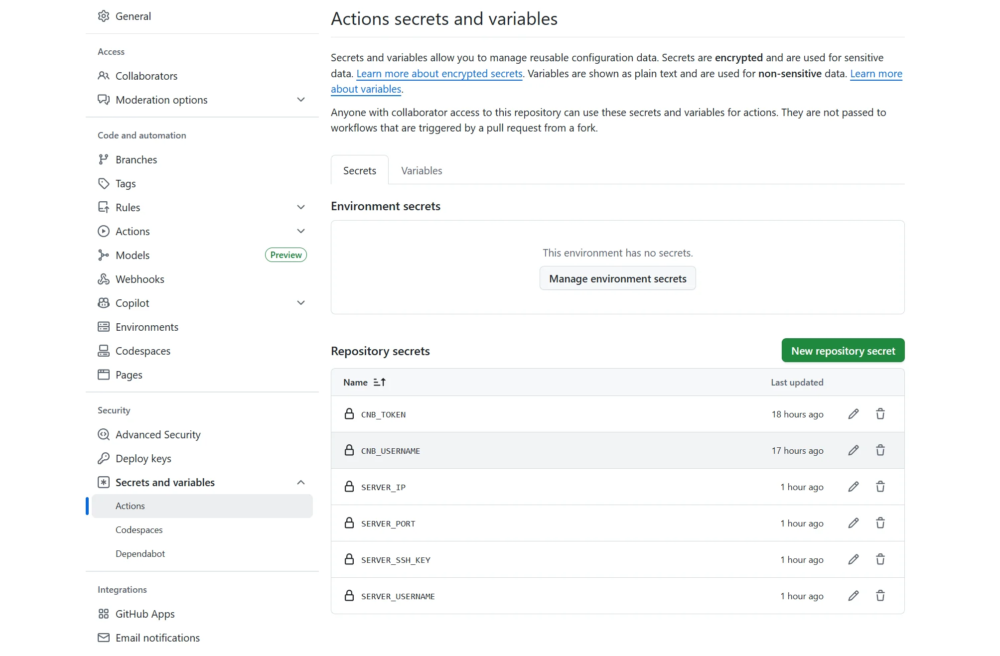

[](https://www.npmjs.com/package/@wojackop/homepage)
[](https://home.gyhwd.top/)
[](/LICENSE)
[](https://saythanks.io/to/wojackop)

## 个人主页项目

一个基于 GitHub Pages 的个人主页，每日自动更新 Bing 高清壁纸。

<p style="text-align: center; margin: 0; padding: 0;">
  
</p>

<p style="text-align: center; margin: 0; padding: 0;">
  
</p>

一个简洁、美观的个人主页，灵感源自 [dmego](https://github.com/dmego) 的 [dmego-home-page](https://github.com/dmego/dmego-home-page) 项目。基于 GitHub Actions，每日上午 9 点（北京时间）自动抓取必应（Bing）高清壁纸，生成 `assets/json/images.json` 文件，由 `index.html` 通过 `JSONP` 方式加载并执行 `getBingImages` 函数，动态设置最新背景图，

**原基于 GitHub Pages，现已全面升级为全自动、低延迟、高可用的国产化部署方案：**

> 🌐 **GitHub Actions → `page` 分支 → 腾讯云 CNB → SSH 同步至自建服务器 (`home.gyhwd.top`)**

## ✨ 功能亮点

- 📅 **每日自动更新**：利用 GitHub Actions 定时任务，每天凌晨 1 点（UTC时间）自动从 `cn.bing.com` 抓取最新的高清壁纸（1920x1080）。
- 💬 **每日一言**：集成 [一言](https://hitokoto.cn/) API，为页面增添一句随机的励志或哲理名言。
- ⚡ **轻量高效**：移除了 jQuery 依赖，使用原生 JavaScript，加载更快。
- 🎨 **鼠标特效**：集成鼠标点击爆炸五颜六色特效，增加互动乐趣。

- 🚀 **全新部署架构**（✨ 核心升级）：
  - ✅ 每日生成的静态资源推送至 `page` 分支
  - ✅ **腾讯云 CNB 自动拉取 `page` 分支并构建**
  - ✅ **通过 SSH 自动同步至本人服务器 `/opt/1panel/www/sites/home.gyhwd.top/index`**

## 📦 文件结构

```markdown
├─📁 .github/
│   └─📁 workflows/
│       ├─📄 generate-static-site.yml     # 构建并推送至 page 分支
│       ├─📄 sync-page-to-cnb.yml   # 监听 page 分支变更 → 推送至 CNB 的 main 分支
│       ├─📄 deploy-to-server.yml   # 监听 CNB 更新 → SSH 同步至服务器
├─📁 assets/
│   ├─📁 css/
│   │   ├─📄 footer-style.css         # 网站页脚样式表
│   │   ├─📄 iconfont.css             # 图标字体样式表
│   │   ├─📄 onlinewebfonts.css       # 在线字体样式表
│   │   └─📄 vno.css                  # 主题样式表
│   ├─📁 fonts/
│   ├─📁 img/
│   │   ├─📁 action/
│   │   ├─📄 home.gif                 # 首页动画GIF
│   │   └─📄 logo.png                 # 主要Logo图片
│   ├─📁 js/
│   │   ├─📄 bing.js                  # 获取每日Bing壁纸URL的Node.js脚本
│   │   ├─📄 fireworks.js             # 鼠标点击爆炸特效脚本
│   │   └─📄 main.js                  # 主要JavaScript脚本（包含getBingImages函数定义）
│   └─📁 json/
│       └─📄 images.json              # 存储每日Bing壁纸URL的JSONP文件
├─📄 404.html                       # 404错误页面
├─📄 .gitignore                     # Git版本控制忽略文件列表
├─📄 ActionNotes.md                 # 关于GitHub Actions的说明文档
├─📄 apple-touch-icon.png           # iOS设备上的网站图标
├─📄 CNAME                          # 自定义域名配置文件
├─📄 favicon.ico                    # 网站favicon图标
├─📄 index.html                     # 网站主页HTML文件
├─📄 LICENSE                        # 软件许可证
├─📄 package.json                   # Node.js项目配置文件
└─📄 README.md                      # 项目说明文档
```

## 🎉 配置教程

### 🌐 CNB + 服务器部署配置

1. **配置 CNB 仓库**

- 登录 [CNB 控制台](https://cnb.cool/)
- 创建仓库：`gyhwd.top/AhHui-Homepage.git`

2. **创建 CNB 访问令牌（PAT）**

在 CNB → 安全设置 → 访问令牌，创建一个带以下权限的 Token：
- `repo-code`
- `repo-contents`
- `repo-cnb-trigger`

3. **配置服务器 SSH 密钥**

在服务器上生成 SSH 密钥对，将公钥 `~/.ssh/gh-cnb.pub` 添加至服务器的 `~/.ssh/authorized_keys`

```bash
# 生成无密码 ED25519 密钥对（推荐）
ssh-keygen -t ed25519 -f ~/.ssh/gh-cnb -N ""

# 将公钥添加至 authorized_keys
cat ~/.ssh/gh-cnb.pub >> ~/.ssh/authorized_keys

# 设置严格权限（必须！）
chmod 600 ~/.ssh/authorized_keys
chmod 600 ~/.ssh/gh-cnb*
```

>  若使用 1Panel，可以直接免去上述代码操作，请确保其 SSH 服务已启用“密钥认证”，且端口 22 开放。 

4. **GitHub Actions 配置**

进入你的 GitHub 仓库 → `Settings` → `Secrets and variables` → `Actions`，分别添加以下 Secret：
-  **`CNB_USERNAME`**: 你的 CNB 组织名
-  **`CNB_TOKEN`**: 上述生成的访问令牌
-  **`SERVER_IP`**: 服务器公网 IP
-  **`SERVER_USERNAME`**: 登录用户名（如 `root`）
-  **`SERVER_SSH_KEY`**: **私钥内容**（完整复制，含 `-----BEGIN...-----END-----`）

最终完整的 `Actions secrets`  如下：



### 🎀 NPM 包发布与使用

将网站的静态资源（CSS, JS, 图片, 字体等）打包发布为一个 NPM 包，使用 UNPKG 作为资源文件的 CDN。以下是详细步骤：

1. **项目配置**

首先在 [npmjs.com ](https://www.npmjs.com/?spm=a2ty_o01.29997173.0.0.274d5171Jsoi6V)注册一个账号，在您的项目根目录下创建或修改 `package.json` 文件。

```json
{
  "name": "@您的GitHub用户名/包名",
  "version": "1.0.0",
  "description": "A personal homepage theme for your name.",
  "main": "index.html",
  "repository": {
    "type": "git",
    "url": "git+https://github.com/您的GitHub用户名/您的仓库名.git"
  },
  "keywords": ["personal", "homepage", "theme"],
  "author": "您的名字",
  "license": "MIT",
  "bugs": {
    "url": "https://github.com/您的GitHub用户名/您的仓库名/issues"
  },
  "homepage": "https://您的自定义域名",
  "files": [
    "assets/css/",
    "assets/fonts/",
    "assets/img/",
    "assets/js/"
  ]
}
```

**关键点**：

- **`name`**: 建议使用作用域格式 `@username/package-name`。
- **`files`**: 精确列出要发布的静态资源文件夹。

2.  **发布 NPM 包流程**

```bash
# 1️⃣ 检查当前 npm 源
npm config get registry 

# 2️⃣ 切换到官方 npm 源（发布必须在此源下进行）
npm config set registry https://registry.npmjs.org

# 3️⃣ 登录您的 npm 账号
# 系统会提示您在浏览器中登录，或直接在终端输入用户名、密码和邮箱
npm login

# 4️⃣ 发布包（作用域包必须指定 --access public）
npm publish --access public

# 5️⃣ 【重要】发布成功后，切换回国内镜像源以加速日常开发
npm config set registry https://mirrors.huaweicloud.com/repository/npm/
```

**常见错误**：

- `E402 Payment Required`: 忘记添加 `--access public`。
- `E409 Conflict`: 瞬时错误，稍等片刻后重试 `npm publish --access public` 即可。
- `400 Bad Request`: 包名包含大写字母，需改为全小写。

**其他命令：**

```bash
npm config list -l          # 用于查看当前 npm 的所有配置项及其详细信息，包括默认值和用户自定义的设置。
npm cache clean --force     # 清理 npm 缓存
```

3. **在网页中使用 (UNPKG)**

发布成功后，您可以通过 UNPKG 这个 CDN 服务，在您的 `index.html` 中引用这些资源。

参考：[UNPKG](https://unpkg.com/)

## ⏱️ 自动化工作流

1. **触发运行**：每天 01:00 UTC（北京时间 09:00）自动执行，支持手动触发。
2. **获取壁纸数据**：`bing.js` 调用 Bing API，获取最近 8 天的高清壁纸信息。
3. **生成 JSONP 文件**：将数据转换为 `getBingImages([...])` 格式，写入 `assets/json/images.json`。
4. **构建并推送至 `page` 分支**：在 `static/` 中初始化 Git，创建 `pages` 分支，强制推送以更新 GitHub Pages。
5. **同步至 CNB**：`sync-page-to-cnb.yml` 检测 `page` 变更 → 自动推送至 CNB 的 `main` 分支。
6. **前端加载**：`index.html` 加载 `images.json`，执行 `getBingImages` 函数，设置最新背景图。

## 📝 更新记录

* **2025-09-14**: ✅ **重大升级：全面迁移至 CNB + 自建服务器架构，告别 GitHub Pages，访问速度大幅提升！**

- **2023-08-28**: 将壁纸地址从 `www.bing.com` 换成 `cn.bing.com`，确保在中国大陆也能正常访问。
- **2022-06-10**: 发布 NPM 包，使用 UNPKG 作为资源文件的 CDN。

## 🤝 致谢与参考

- **设计灵感**: 本项目衍生自 [Vno ](https://github.com/onevcat/vno-jekyll)Jekyll 主题。
- **功能参考**: 页面加载效果借鉴了 [Mno ](https://github.com/mcc108/mno)Ghost 主题。
- **头像样式**: 参考了 [北岛向南的小屋 ](https://javef.github.io/)的头像样式。
- **核心机制**: 借鉴并改进了 [dmego ](https://github.com/dmego)的 `dmego-home-page` 项目。

## 📜 许可证

本项目基于 [MIT 许可证 ](https://chat.qwen.ai/c/LICENSE)开源，壁纸版权归 Bing 及原作者所有，仅供学习与个人使用，严禁商用。
